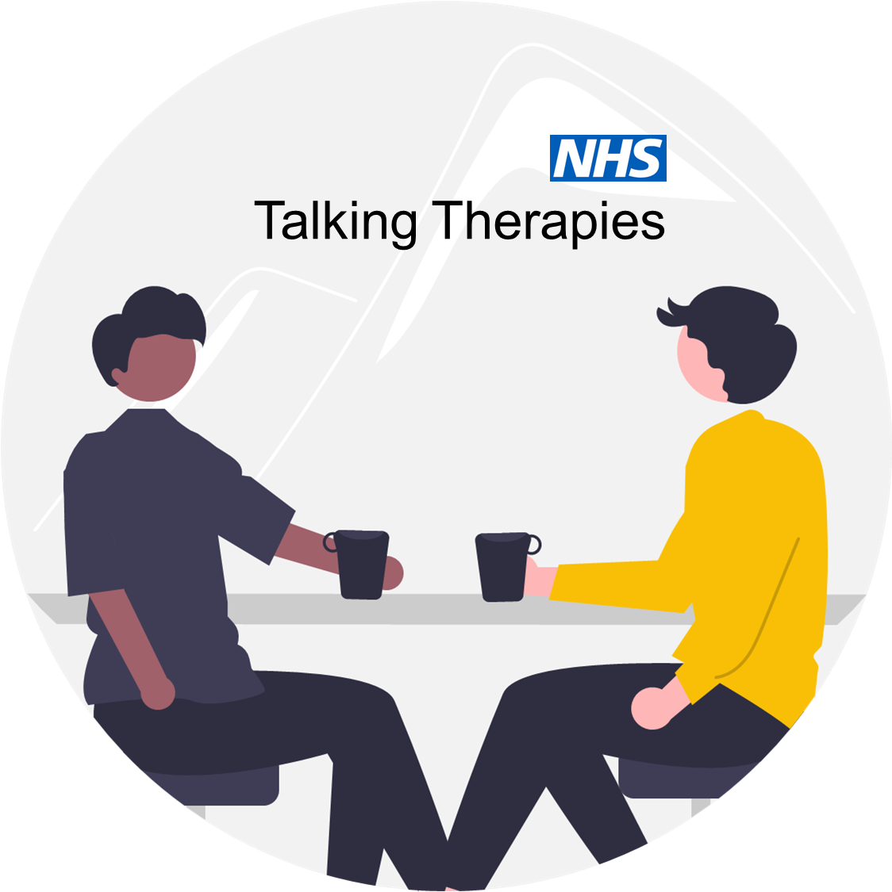

<!-- README.md is generated from README.Rmd. Please edit that file -->

# NHS Talking Therapies

NHS Talking Therapies for anxiety and depression offers psychological
support for common mental health problems. Examples of treatments
include cognitive-behavioural therapy (CBT) and counselling.

In 2023-24, 53% of referrals that started treatment **completed a
course** of treatment. Completing a course of treatment is defined as
attending a minimum of *two* sessions (which can include psychological
assessment and treatment).

The recovery standard for NHS Talking Therapies is that 50% of patients
**achieve reliable recovery**. This standard is achieved by patients
attending at least *five* treatment sessions.

The focus of this evaluation is to explore initiatives designed to
reduce the proportion of patients who complete a course of treatment,
but attend only two, three or four sessions.
